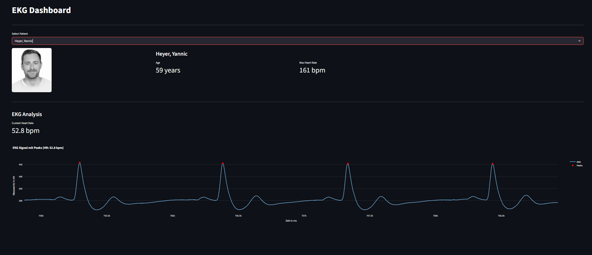
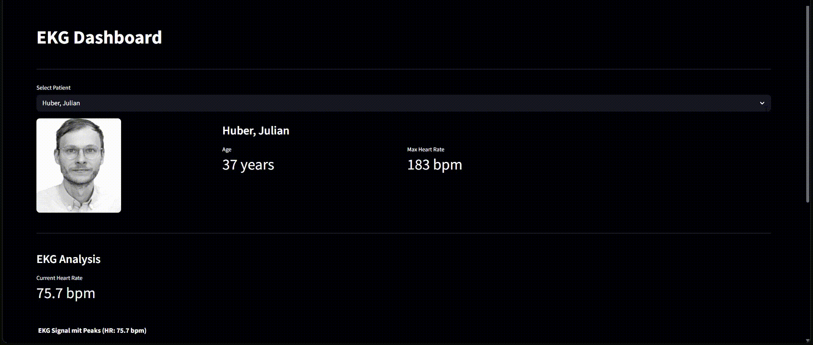

# Dashboard Integration I

Ein Python-Projekt zur Visualisierung von Personen und deren EKG-Daten in einem interaktiven Streamlit-Dashboard.

## Beschreibung

Das Dashboard laedt Personendaten aus einer JSON-Datenbank und zeigt diese zusammen mit den zugehoerigen EKG-Daten an. Fuer jede Person wird das Alter und die maximale Herzfrequenz berechnet. Die EKG-Daten werden als interaktiver Plot dargestellt, in dem die R-Peaks markiert und die Herzfrequenz berechnet wird.

<table>
  <tr>
    <td></td>
    <td></td>
  </tr>
  <tr>
    <td align="center"><b>Screenshot</b></td>
    <td align="center"><b>Demo</b></td>
  </tr>
</table>

## Projektstruktur

```
Dashboard_Integration_I/
├── main.py
├── UI.py
├── person.py
├── ekgdata.py
├── data/
│   ├── person_db.json
│   ├── ekg_data/
│   └── pictures/
├── images/
│   ├── screenshot.png
│   └── demo.gif
├── pyproject.toml
├── pdm.lock
└── .gitignore
```

## Voraussetzungen

- Python 3.12 oder neuer
- PDM

## Installation

```bash
pdm install
```

## App starten

```bash
pdm run streamlit run main.py
```

## Funktionen

- Personenauswahl per Dropdown
- Anzeige von Foto, Alter und maximaler Herzfrequenz
- EKG-Test Auswahl
- Interaktiver EKG-Plot mit markierten R-Peaks
- Berechnung der Herzfrequenz in bpm

## Autoren

Antonio Mrkonja, Lenn Oßwald, Noah Reinermann
